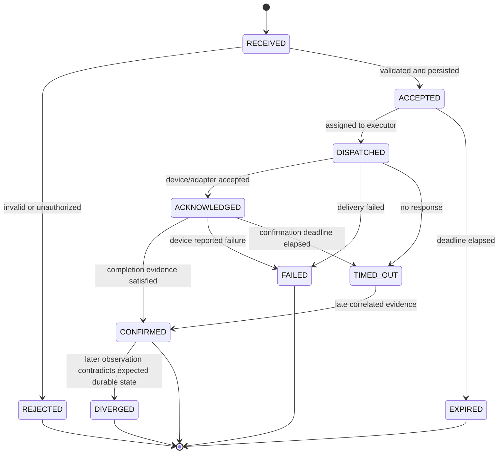

# Command Lifecycle

Status: Proposed for implementation  
Version: 0.1

Applicability (2026-10-02): the durable device-command and evidence boundaries remain applicable under [v0.3](device-node-services-v0.3.md), which adds stable operation identity, bounded scheduling and explicit effect semantics. This lifecycle does not apply to request-scoped inference. The implemented status subset remains defined by the execution API; proposed states below are not all implemented. WSS migration replaces polling without discarding command history or weakening deduplication.

## Purpose

Implementation note (2026-09-14): the virtual-light subset is implemented as described
in [execution API](../api/execution.md). The command row doubles as the durable pull
queue, avoiding a separate outbox/broker for this transport. `none`, `adapter_ack`,
`device_event`, post-confirmation divergence and external policy grants are not enabled.

A command is a durable request to change or interact with the physical world. The API must distinguish request acceptance, protocol delivery, device acknowledgement, and observed completion.

## Internal state machine



`DIVERGED` is an operational signal, not an automatic retry request. A policy or application decides whether compensation is safe.

## Public status projection

The public API exposes a smaller stable vocabulary:

| Public status | Internal states |
|---|---|
| `accepted` | ACCEPTED |
| `running` | DISPATCHED, ACKNOWLEDGED |
| `succeeded` | CONFIRMED |
| `failed` | REJECTED, FAILED, TIMED_OUT, DIVERGED |
| `expired` | EXPIRED |

Detailed receipts expose the internal progress without coupling clients to internal orchestration.

## Invocation rules

1. Validate syntax and capability input schema before persistence.
2. Resolve Device, CapabilitySpec, Binding, and eligible EdgeNode.
3. Validate authorization, safety policy, device lifecycle state, and deadline.
4. Deduplicate by caller identity plus idempotency key.
5. Persist Command, initial receipt, and outbox event in one transaction.
6. Dispatch only after durable acceptance.
7. Require the confirmation mode declared by the capability.
8. Emit immutable receipts for every meaningful transition.

## Confirmation modes

- `adapter_ack`: sufficient for operations whose protocol acknowledgement proves completion.
- `observed_state`: requires a correlated state observation matching the expected state.
- `device_event`: requires a device-originated completion event.
- `none`: fire-and-forget; public result must not claim physical completion.

High-risk actions must never use `none`.

## Idempotency

The same caller, target, action, and idempotency key returns the original Command. Reusing a key with different normalized input is rejected with a conflict response.

Idempotency prevents duplicate requests from becoming duplicate physical operations. It does not imply that an inherently non-idempotent device protocol can be safely retried; the Adapter must declare retry behavior.

## Timeout and late evidence

A timeout means confirmation was not received before the deadline. It does not prove the physical action did not happen. Late evidence is retained and may move `TIMED_OUT` to `CONFIRMED`, while the audit log records both events.

## Minimum receipt

```json
{
  "command_id": "cmd_01J...",
  "sequence": 3,
  "stage": "confirmed",
  "executor_ref": "edge:home-01",
  "occurred_at": "2026-09-13T15:00:00Z",
  "evidence": {
    "kind": "state_observation",
    "observation_id": "obs_01J..."
  },
  "trace_id": "trace_01J..."
}
```
