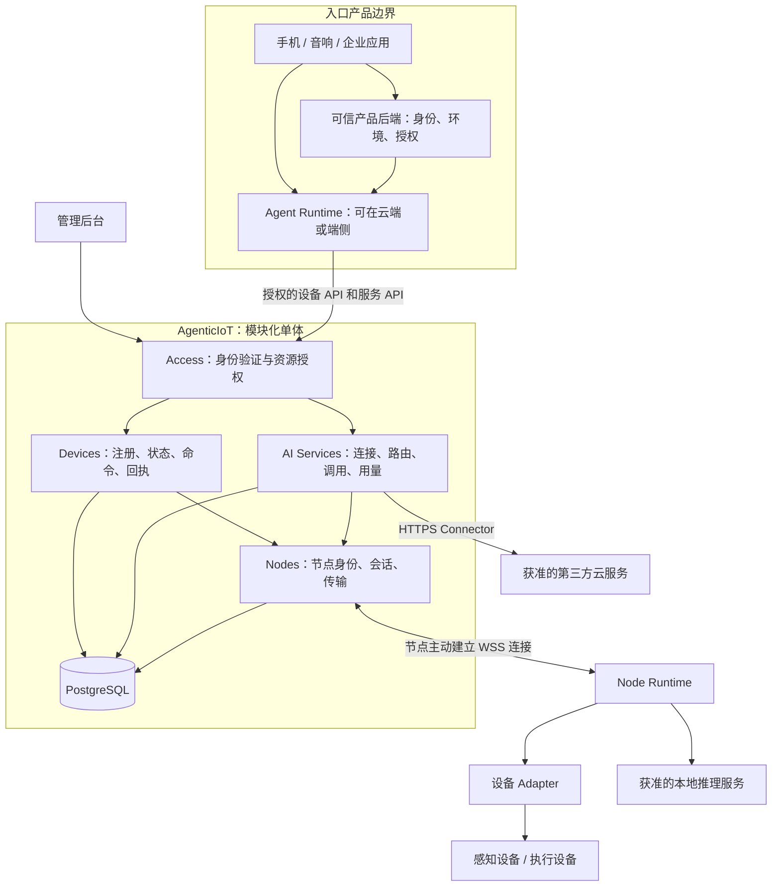

# AgenticIoT 设备与 AI 服务技术架构设计

状态：历史已接受基线，已被 v0.3 修订。版本：0.2。确认日期：2026-10-02。

当前权威入口为[设备与 Node 本地服务技术架构 v0.3](device-node-services-v0.3.md)和 [ADR 0009](../adr/0009-node-local-services-and-agent-access.md)。下文保留当时设计，不再作为当前首版范围：云模型及备用、推理队列和正文持久化、原始 domain_ref 分区、长期双传输均已调整；Agent 工具与设备事件已提前。历史正文中的“当前”“首版”“权威”均指 v0.2 当时状态，不覆盖 v0.3。

AgenticIoT 定位为面向 Agent 和应用的设备与 AI 服务接入、授权调用及执行管理平台。入口决定为谁服务、使用哪个环境和哪个 Agent；平台校验可访问的资源，连接设备与推理服务，返回可信状态、结果和执行证据。

本文是后续详细设计、开发和验收的权威架构基线，取代 v0.1 中与本文冲突的系统定位、模块划分和首版范围。架构决策见 [ADR 0008](../adr/0008-device-and-ai-service-platform.md)。未冲突的设备能力、命令证据和真实硬件安全约束继续有效。

设计已确认不代表功能已实现。新增模块、API 和连接协议是待实现的目标；当前实现状态见第 15 节。本文发布不修改业务代码、不开放真实设备控制、不宣布生产就绪。具体字段 Schema、协议编码及运行参数属于下一阶段详细设计，不得改变本文规定的职责与安全语义。

## 1. 核心判断

不再增加独立的“家庭大脑”或“域服务中心”。保留两个业务模块：设备管理与执行、AI 服务接入与调用。二者共用身份校验和节点连接设施，但不共用业务状态机。

“算力中心”在本系统中是提供推理能力的服务节点，而不是 GPU 调度器。云上的第三方模型也是服务提供方，无须伪装成一台 IoT 设备。感知、推理、执行是可组合的能力：同一台音响可以同时承担入口、节点、传感和执行角色，但各角色的授权仍独立。

第一版采用模块化单体、一个 PostgreSQL、独立 Node Runtime。首发部署为云平台加节点，先支持文本推理和现有设备链路，不引入微服务、消息中间件、通用工作流或云边双主。

## 2. 系统边界

| 责任主体 | 负责 | 不负责 |
| --- | --- | --- |
| C 端产品及其可信后端 | 用户、家庭、公司关系；当前环境；Agent 选择；会话记忆；付费及数据使用授权的产品流程 | 绕过平台资源授权、直接分发平台保管的服务密钥 |
| Agent Runtime | 理解意图、业务规划、调用模型和工具、判断是否需要确认 | 自行扩大权限；把模型输出当作已完成的物理动作 |
| AgenticIoT | 资源注册、授权校验、连接状态、服务路由、调用记录、设备命令及回执 | 人的关系图谱、长期记忆、Agent 编排、模型训练、GPU 调度、支付结算 |
| Node Runtime | 连接平台、接入获准的本地服务和设备、执行本地调用、可靠上报 | 自行授权新资源；断网后无限期使用过期权限；自动暴露本机所有端口 |
| 设备和服务提供方 | 传感、执行、推理及各自的安全机制 | 保证平台到业务入口之间的完整事务 |

入口不是天然可信边界。音响选择了家庭 A，不代表它可以在请求体里填写家庭 B。入口表达上下文，可信后端授予权限，平台执行隔离。

平台只保存外部提供的、经过可信映射的 `domain_ref`，不建立家庭成员和公司组织模型。资源在注册时绑定该范围；切换入口或 Agent 不迁移资源归属。不同产品的外部域标识必须经过发行方和客户端命名空间映射，避免两个产品的 `home-1` 被误认为同一个域。

## 3. 总体架构

图中箭头是调用依赖，不代表每次调用都经过所有模块。管理后台只是 API 客户端，不另建业务规则。Agent 的部署位置不改变平台职责：模型结果回到 Agent，由 Agent 决定是否另外提交设备命令。

## 4. 四个代码边界

这些是代码模块，不是四套部署服务。

| 模块 | 唯一所有权 | 对外接口示意 |
| --- | --- | --- |
| Access | 可信调用上下文、凭据校验、权限判定 | `authenticate`、`authorize` |
| Nodes | 节点登记、允许的连接能力、在线会话、传输适配 | `NodeDirectory`、`NodeChannel` |
| Devices | 设备模型、资源、绑定、观测、命令、回执 | `DeviceService`、`CommandService` |
| AI Services | 服务连接、服务别名、路由版本、调用及尝试 | `ServiceCatalog`、`InvocationService` |

模块通过显式 Python 接口和类型化 DTO 协作。不得导入其他模块 ORM 后直接更新其表，不通过继承另一个业务 Service 获得隐含权限。共同的数据库会话、审计、时钟和密钥读取属于小型基础设施，不另建“基础服务平台”。

Nodes 只运送类型化消息，不决定推理是否重试或设备命令是否成功。业务处理器在应用组合入口注入，避免 Nodes 反向依赖两个业务模块。跨模块管理页面通过查询接口组合数据；共享数据库可以有外键，但数据库写入归属必须唯一。

当前 `registry` 与 `runtime` 已存在双向业务依赖，设备展示会读取运行时状态，Edge Service 也复用了业务 Service。二者统一归入 Devices 边界，逐步抽取 NodeDirectory 和展示查询接口；不为目录美观立即大规模搬代码，也不让新 AI 模块继续继承这些耦合。

## 5. 最小领域模型

| 对象 | 含义和约束 |
| --- | --- |
| Node | 安装 Runtime 的连接节点。沿用现有 Edge 身份演进，保留原 ID，不重复注册成 Edge 和 Compute 两个节点 |
| Device、DeviceModel、Binding | 沿用现有设备模型和绑定。普通 BLE 等设备可由 Node 代理，不必各自安装脚本 |
| Observation、Command、Receipt | 沿用设备观测、动作和证据语义，不承载模型生成任务 |
| ServiceConnection | 一个授权范围内可用的服务连接：Node 上的已批准服务引用，或受控 HTTPS 提供方与密钥引用 |
| Service | 面向调用方的稳定服务别名，例如 `chat.default`；包含版本化契约与有序候选配置 |
| Invocation | 一次业务层推理请求，保存幂等身份、路由版本、期限、最终结果引用和状态 |
| InvocationAttempt | 对某个提供方的一次真实调用；记录实际模型、尝试状态、错误及用量 |

第一版仅定义 `text.generate.v1` 契约，涵盖文本输入、生成参数、文本增量、结束原因和用量。工具调用如有支持，只是返回 Agent 的结构化数据，平台不自动执行。带外部工具副作用的托管 Agent 服务不纳入首版“纯推理”连接。

路由是 Service 内的类型化配置，首版只需一个首选和一个可选备用。先不建立独立规则引擎、调度集群或模型能力市场。契约兼容不代表模型质量、推理能力和输出内容等价；调用结果必须标明实际提供方、模型和配置版本。

本地连接只发布已批准的 `local_service_ref`，实际地址及本地密钥由 Node 配置。云连接使用受控 endpoint 和 `secret_ref`，不把密钥放进服务目录、前端或 Agent 上下文。“公共云”只是提供方位置，不意味着所有人都能使用该连接。

## 6. 身份与授权

入口的可信后端或受信任身份发行方提供短期、限定受众和权限的凭据。平台验证后生成 `RequestContext`，至少包含发行方、客户端、主体、映射后的 `domain_ref`、权限、有效期及追踪信息。浏览器、音响和请求体不能自行声明管理员权限。

若采用 JWT，必须校验签名算法、发行方、受众、有效期及密钥绑定，不能只解码 payload。这是标准要求，而非已有实现；参见 [JWT 安全实践 RFC 8725](https://www.rfc-editor.org/rfc/rfc8725.html)。现有静态本地 Token 仅是开发机制。

至少区分设备读取、设备动作、AI 调用、资源管理和节点提供服务权限。Node 凭据仅能操作自己获准的绑定与调用，不能因为它提供模型就获得用户或管理员权限。敏感物理动作的确认授权必须由可信入口绑定到具体动作，不能由模型填写 `confirmed=true` 来代替。

发布连接和修改路由需要管理权限。请求可以收紧限制，不能放宽已授予的出域或计费权限。所有查询、结果读取、流订阅和取消操作都检查同一资源范围，不能只在创建时检查。

派发前重新检查权限、禁用状态及期限。撤销能阻止尚未派发的工作，但不能撤回已发送的数据、已发生的计费或物理动作。连接凭据设有限有效期与轮换机制；撤销传播时限必须在实现时定义和测试，不宣称瞬时全球撤销。

## 7. AI 服务路由

路由顺序是：验证调用资格 → 校验输入契约 → 固定配置版本 → 过滤不满足硬约束的候选 → 按配置顺序选择 → 记录真实调用。

硬约束包括权限、契约和参数兼容性、提供方健康、容量、请求期限、允许的数据路径，以及云费用授权。没有候选时返回明确错误，而不是偷偷放宽规则。

首版不按实时价格竞价，不承诺智能负载均衡。节点上报的容量只用于准入，真正接收时仍可明确拒绝为 busy。服务健康、Node 在线和设备状态新鲜度是三个独立维度。

### 本地执行不等于数据留在本地

云端平台把输入转发回家中模型，输入仍经过云端。服务目录必须区分执行位置和允许的数据传输路径，不能仅凭 `local=true` 承诺隐私。

- 允许平台中转：可以使用云端平台连接家庭模型，也可以按授权使用云模型。
- 严格不出家庭：入口、Agent、平台调用路径和推理均须满足本地边界；完整本地部署是后续支持此模式的演进方向，不属于云端首发承诺。
- 云端部署收到严格本地请求而没有合规路径：拒绝调用，不自动降级。端到端加密直连或云边联邦留待专门设计。

### 备用服务不是无条件重试

只有明确未发送，或提供方明确保证未接收执行时，才允许自动选择备用。网络超时、进程崩溃或“没有收到第一个 token”都不能证明原请求没执行。

默认不对结果未知的调用自动重发，不并发竞速多个提供方；已有输出后不切换模型拼接答案。采用提供方幂等或结果查询能力时，必须有该提供方的明确契约，不能假定所有兼容接口都支持。该保守策略与 [HTTP 非幂等请求的自动重试约束](https://www.rfc-editor.org/rfc/rfc9110.html#section-9.2.2)一致。

如果用户明确固定某模型，就不隐式切换。路由允许切换时也必须记录实际选择。费用和出域是两项独立授权；某一项允许不代表另一项也允许。

## 8. 两条调用链路

### 推理链路

1. Agent 提交 Service、输入、幂等键和期限，平台鉴权并持久化 Invocation，返回 `202` 和调用 ID。
2. AI Services 从自己的持久化记录领取工作，固定一次 Attempt 和候选配置，在数据库事务提交后发送网络请求。
3. 云服务经 HTTPS Connector 调用；本地服务经 NodeChannel 调用，再由 Node 访问获准的本地服务。
4. 增量输出按 Attempt 和序号传回；完成时保存结果、提供方身份和用量。
5. Agent 读取结果，独立决定下一步。平台不会因为文本里出现“打开灯”就执行命令。

Invocation 的主状态为 `queued`、`running`、`succeeded`、`failed`、`cancelled`、`expired`、`unknown`。排队过期可以确定未执行；发送后超时若不能确认提供方停止，进入 unknown，不能伪装成安全失败。取消在发送前可确定，在发送后是尽力请求，未获确认就不能宣称已取消或免费。

unknown 可在同一 Attempt 收到可信完成证据后对账为成功或失败，保留状态版本和审计，不启动新尝试。迟到结果只是结果更新，不自动触发任何设备动作。网络中断不自动取消业务任务，任务仍受服务器期限限制；客户端需要取消时使用显式接口。

### 设备链路

Agent 提交具备稳定动作意图幂等键的命令 → Devices 校验能力与授权 → 持久化命令 → 固定 Binding 派发 → Adapter 执行 → 收集相关证据 → 返回命令状态及回执。

命令已接收、Node 已接收、硬件已执行、观测已确认是不同事实。Node 失联不代表动作失败，读到目标状态也不总能证明该命令执行过。结果未知时不能自动换设备或换 Node 重放动作。

Agent 重试推理时，不得为同一个业务动作生成新幂等键来绕过去重；平台无法自动识别两个不同键其实代表相同人类意图。设备动作与推理不是跨模块原子事务，不承诺模型生成失败能够回滚已发生的物理动作。

## 9. 幂等、流式输出与背压

推理幂等范围为可信客户端、域、主体和操作，加调用方幂等键。相同键和输入指纹返回原调用；同键不同输入返回冲突；unknown 状态不能通过原键重新执行。幂等保留期必须作为 API 契约发布，正文清理后仍保留必要的去重指纹。

SSE 只负责客户端接收增量事件，不作为永久日志。第一版采用有界增量缓冲，持久化最终结果和状态，不逐 token 写 PostgreSQL。事件带 Attempt ID 和单调序号；重连超出缓冲范围返回 `reset_required`，由客户端查询最终结果，不能为了补流重新调用模型。结果超过保留期返回已过期，而不是重新计费生成。

限制请求大小、排队深度、每域及每节点并发、输出上限、执行时间和连接缓冲。超额返回显式 busy 或限流，禁止无限队列。文本流与控制消息区分优先级；音视频大流量不挤进同一控制通道，首版不承诺媒体流能力。

## 10. Node Runtime 与连接协议

Node 主动发起 TLS WebSocket，避免要求家庭公网入站端口。初次注册通过受限、短期的引导凭据完成，之后使用独立节点凭据。服务探测只针对显式配置的本机地址或获准范围，探测结果需批准后发布，不自动扫描并暴露任意端口。

WebSocket 是双向传输，不提供业务持久化或物理动作“恰好一次”保证；参见 [RFC 6455](https://www.rfc-editor.org/rfc/rfc6455.html)。应用协议需要版本、消息 ID、节点及会话代次、Command 或 Attempt ID、序号、期限、追踪 ID 和类型化载荷。

首版消息覆盖：注册能力清单、心跳、设备命令与回执、观测、推理派发与增量及完成、取消。传输收到 ACK 与执行器持久化接受 ACK 必须区分。消息中自报的节点或域不是授权依据，服务器始终对照认证会话和绑定。

平台工作记录持久化，Node 用本地日志保存执行意图和待上报结果；允许至少一次传递，通过稳定标识去重。外部硬件和模型服务不受平台事务控制，因此仍需要 unknown 状态，不能靠日志宣称恰好一次。

每个 Node 只有一个当前派发会话，以代次和期限排除旧会话领取新工作。代次不能撤销已经发给硬件的动作，也不能支持两个独立控制器随意接管。新会话可以上报旧 Attempt 的真实证据，但须校验原执行归属和标识，不能把所有迟到结果一律丢弃。

现有 HTTP 拉取保留为旧版 NodeChannel 适配。迁移时每个节点只启用一种派发方式，两种通道共享同一领取权，不能各跑一套调度器重复下发。兼容是有退出条件的协议迁移，不是永久维护两套业务逻辑。

## 11. 数据、持久化与安全

沿用 PostgreSQL 与 Alembic。Devices 持有自己的命令队列记录；AI Services 持有 Invocation 队列记录，各自采用短事务领取和条件状态更新。网络 IO 不占用数据库事务。第一版不另外复制一份通用任务队列或消息总线；将来确需外部消息系统时再引入事务 outbox。

节点会话信息归 Nodes，服务和推理表归 AI Services。尝试记录内保存提供方用量、估计值或未知标记，避免过早建计费账本。平台记录运营用量，不处理钱包、支付、对账结算或服务市场。

持久化排队意味着要保存待执行输入：加密、短保留期保存必要输入及最终输出，元数据与审计采用独立保留策略。密钥不与数据库密文一起保存。不以“无记忆”掩盖平台实际留存正文；产品须披露保留策略。严格不落正文的模式将牺牲恢复能力，不能同时承诺两者。

日志默认不记录完整输入、输出和凭据；Node 日志与结果缓存也受相同原则约束。现有开发日志不等于完成了生产级加密和密钥管理。客户端自报用量与提供方确认用量分开，未知费用不是零费用。

首版使用明确批准的服务账号及密钥引用，管理 API 不回显密钥。服务 endpoint 只可由受权管理者从允许范围配置，执行时限制 DNS、重定向、目标地址及 TLS 校验，防止变成访问内网和云元数据的代理。Node 不提供通用 shell、任意 URL 转发或任意文件读取能力。

费用控制先做调用次数、并发和输出上限；若要承诺严格金额上限，必须有可靠价格、费用边界和预留机制，不能以估算 token 费用假装硬预算。平台垫付公共云费用和商业结算不是首版默认行为。

## 12. API 与管理后台

以下为已确认的目标接口划分，不代表已经实现或写入实际 OpenAPI。字段、错误 Schema 和节点协议编码在详细设计阶段补齐；已实现契约快照仍只描述实际代码。

| 使用方 | 接口 | 语义 |
| --- | --- | --- |
| Agent / 应用 | 现有设备、动作、命令 API | 保持现有契约，设备调用不改成 AI 通用任务 |
| Agent / 应用 | `GET /v1/services`、`GET /v1/services/{id}` | 只发现自己有权调用的服务和契约 |
| Agent / 应用 | `POST /v1/services/{id}/invocations` | 创建推理请求，返回 202；要求幂等键 |
| Agent / 应用 | `GET /v1/invocations/{id}` | 查询状态、真实提供方、结果和用量 |
| Agent / 应用 | `GET /v1/invocations/{id}/events` | 有界 SSE 流，不承诺无限重放 |
| Agent / 应用 | `POST /v1/invocations/{id}/cancel` | 申请取消；响应区分申请和已确认 |
| 管理后台 | `/v1/management/service-connections`、`/v1/management/services` | 配置连接、启停服务和修改有序路由 |
| Node | 版本化节点注册 API 与 WSS 通道 | 独立凭据；不是管理 API 的超级用户 |

输入使用版本化 JSON Schema，配置修改采用版本条件更新，防止覆盖他人修改。错误返回机器可读 code、request ID 和明确的重试提示；鉴权失败、权限不足、幂等冲突、契约不符、限流、无可用提供方与执行未知必须区分。跨域资源查询避免泄露资源存在性。

不让所有模型参数成为无约束透传对象：首版公开已支持的标准参数，提供方差异在 Connector 内显式适配；不支持的参数拒绝，不默默忽略。对外 SDK 可在稳定 OpenAPI 后生成，不预先建立多语言 SDK 项目。

管理后台延续现有 React 应用，只增加三组必要视图：节点的获准服务与连接健康；AI 服务及首选/备用配置；调用详情、Attempt、错误和用量。保留设备状态和命令时间线。不建设聊天应用、Agent 工作流编辑器、家庭成员系统和支付后台。

## 13. 部署与运行边界

首发部署：云端一个平台后端进程，加 PostgreSQL 和现有管理前端；Node Runtime 独立部署在家庭或其他获准环境。继续沿用 FastAPI、Pydantic、SQLAlchemy、Alembic 和 React/TypeScript，不因新增推理服务更换整个技术栈。

首版进程内有有界异步派发任务和 WebSocket 会话，不能直接启动多个独立 Web Worker 并假定会话自动共享。重启后可恢复未派发工作；对已经发出的调用先判定或标记 unknown，不能一律重新排队。首版不承诺无损流恢复或高可用。

完整本地部署作为后续选项，不纳入首发交付。若后续要求断外网运行或数据严格留家，则将同一套平台、数据库和 Agent 部署在本地，并单独验证凭据有效性、全部数据出口、安装升级及备份恢复。它是完整、单一权威的部署，不是云端平台的一份双向可写副本；仅把模型搬到家庭不满足这些要求。

未来扩容之前再设计跨实例连接归属、任务租约、故障接管与流分发；未来云边协同之前再设计同步、权限租约和冲突规则。现在明确限制，不提前建设，也不把这些能力描述为天然具备。

运维至少覆盖数据库备份恢复、迁移验证、凭据轮换、优雅停止领取任务、健康检查和容量限制。可观测性以排队时延、首 token 时延、提供方错误、unknown 比例、节点失联、设备证据时延、授权拒绝和用量未知为主。SLA 和容量数字在测量后确定。

## 14. 必须固定的故障语义

| 情况 | 应有行为 |
| --- | --- |
| 本地服务在发送前已确定不可用 | 仅在路由、出域和费用授权均允许时选择备用 |
| 请求已发出但未收到任何输出 | 标记结果未知或使用提供方明确支持的查询，不凭“没输出”自动重试 |
| 已收到部分模型输出后中断 | 保留部分输出及失败/未知信息，不拼接另一个模型的答案 |
| 客户端 SSE 重连超过缓冲窗口 | 通知重置并查询结果，不新建调用 |
| Node 断连或旧会话复活 | 停止新派发、隔离旧会话领取权；保留对已执行工作的证据接收能力 |
| 物理动作已发送但没有确认 | 按设备证据规则处理未知，不切换绑定后重新执行 |
| 用户切换入口或 Agent | 使用新的获准上下文，不迁移原资源归属，不放宽访问范围 |
| 平台云部署收到严格本地数据要求 | 没有合规路径就拒绝，不把“家庭模型”当作数据未出域的证明 |
| 调用完成但用量未返回 | 用量为 unknown，不记录为零，也不重复调用来补统计 |

## 15. 现状与目标之间的差异

当前已具备设备注册、模型与能力校验、域范围过滤、持久化命令、独立模拟 Edge、相关回执、状态新鲜度、审计和管理页面；MQTT 示例连接的是模拟设备，并非家庭真实硬件。

当前尚不具备生产入口授权、通用 AI 服务目录和调用、Node WebSocket、推理流式输出、云服务路由及生产级密钥管理。旧架构中的部分设计能力也不等于当前已实现。

v0.2 的已确认变化是：增加独立 AI Services；将既有 Edge 连接职责抽成共用 Nodes；把家庭/个人语义完整留给入口；首版不做云边双主和离线授权体系。现有设备执行安全边界不变，真实设备仍遵循[先确认目标、再只读验证、再单独授权动作](../adr/0007-first-physical-device-gates.md)。

平台定位和架构决策已随本文同步更新。[v0.1 系统架构](system-architecture.md)保留为历史参考，不再是当前基线。其他 v0.1 细分文档中的通用离线执行、节点自动接管、必需 outbox 和完整生命周期编排不构成 v0.2 首版交付要求；未冲突的设备模型及证据约束继续适用。新增目标 API 不混入已实现契约快照。

## 16. 落地顺序与验收

1. 以本文和 ADR 0008 为基线，完成 `text.generate.v1`、可信上下文、NodeChannel 和状态转换的详细契约及测试用例，不重新扩大产品边界。
2. 在设备行为不变的测试保护下，抽取节点目录、传输和可信上下文接口；保留现有资源 ID、绑定和回执。
3. 建立 AI Services 的纵向切片：两个可控模拟 Connector、持久化调用、结果查询、流输出和明确的备用规则。
4. 接入 Node WSS 与一个经批准的本地推理服务，验证断连、重复消息、背压、日志恢复和真实服务错误。
5. 接入一个 C 端可信后端；在数据与费用授权明确后，验证一个云提供方。补齐管理后台与运维检查，再评估生产发布。

真实硬件工作可按已有门禁独立推进，不作为证明 AI 服务架构的先决条件。首版不因等待新硬件而停住，也不为了演示把 simulated 限制改个名字就当作真实设备支持。

关键验收包括：跨域和跨产品访问被拒；节点凭据不能调用用户管理接口；模型输出不自动执行动作；同键重试不重复派发；不确定请求不自动切换；流不混用不同 Attempt；重启不盲目重发；严格本地请求不走云中转；禁用连接后无新派发；积压受限；密钥与正文不进入常规日志；费用未知得到保留。

第一版成功标准不是覆盖所有设备，而是同一个授权入口可以发现资源、调用本地或获准云模型，再独立提交一个受约束的设备动作，并完整查询两条链路的真实结果。

## 17. 已确认的首版决策

| 事项 | 已确认决策 | 后续变更条件 |
| --- | --- | --- |
| 首版是否要求断网运行、数据严格留家 | 云平台加 Node；首发不承诺上述能力 | 若必须支持，应优先完整本地部署，而不是给云架构补“离线模式” |
| 首个 AI 能力是什么 | 文本生成，先验证端到端服务调用 | 语音优先需要媒体授权、传输及存储设计，不能只新增几个字段 |
| 入口如何提供可信上下文 | 接入产品的可信后端或受信发行方 | 仅有前端而无可信授权来源时，必须先解决身份和凭据签发 |
| 公共云费用由谁承担 | 明确配置的服务账号；不默认平台垫付 | 平台代付需要独立预算、账务和商业授权范围 |
| 自动备用能走多远 | 仅明确未执行时切换；未知不切换 | 更激进策略需要明确接受重复费用及重复处理风险，不能隐藏为实现细节 |

上述决策已由用户于 2026-10-02 确认。后续变更通过新增或替代 ADR 记录，不在实现中静默扩大范围。

## 18. 详细设计与发布门禁

架构基线固定职责和语义，不虚构尚未选定的提供方、硬件或生产容量。以下事项由对应模块在编码或生产接入前完成，不作为重新选择架构的开放问题：

| 交付物 | 负责边界 | 完成条件 |
| --- | --- | --- |
| 可信上下文与授权契约 | Access 与入口集成 | 明确发行方、客户端映射、受众、权限、撤销时限；跨域负向测试通过 |
| 文本推理与错误 Schema | AI Services | 输入输出、幂等指纹、路由版本、状态转换、取消竞态、SSE 重连契约齐全 |
| 节点协议与迁移契约 | Nodes | 帧编码、消息大小、心跳与租约、去重、背压、单通道派发和旧协议退出条件明确 |
| 设备兼容性证明 | Devices | 原注册、绑定、命令、回执和模拟执行测试保持通过；无动作重放回归 |
| 运行与数据配置 | 运维及对应模块 | 凭据和加密密钥管理、正文保留期、幂等保留期、队列和并发限额、备份恢复经验证 |
| 实际提供方接入 | AI Services 与入口集成 | 账号和费用承担方已授权；数据路径与计费限制明确；提供方超时及取消语义有证据 |

所有上线参数必须显式配置或具有经过测试并记录的安全默认值；缺少可信授权、密钥或必要数据策略时拒绝启用相应能力。首发容量与 SLA 以负载测试结果为准，不从架构图推定。

交付状态分为“架构已接受”“契约已完成”“实现已验证”“生产可用”，不得互相替代。本次交付完成的是第一项。
