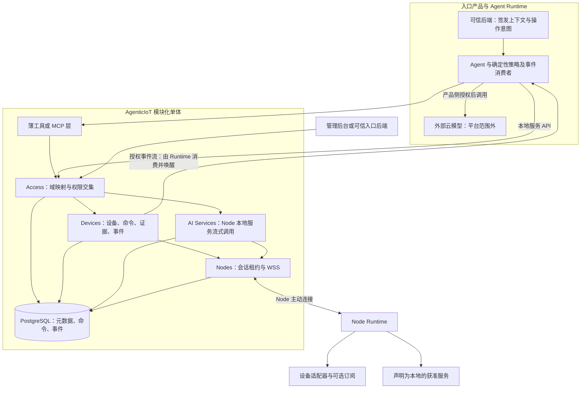

# AgenticIoT 设备与 Node 本地服务技术架构

Runtime amendment: [ADR 0012](../adr/0012-pilot-recovery-and-transport-bounds.md) defines current recovery, command credits, clock handling, transport bounds and retention. Product boundaries remain unchanged; [operational guidance](../operations/pilot-recovery.md) explains the upgrade.

版本：0.3。日期：2026-10-02。状态：产品边界与行为规则已接受；性能、容量和兼容性待实验验证。

本版依据两轮评审共识收窄 v0.2：AgenticIoT 负责设备的可信操作，以及经 Node 主动连接访问私有网络中的获准服务。首版 AI Services 只接 Node 上的本地服务，采用请求内流式响应；设备命令继续异步持久化。Agent 工具与设备事件进入首版主线。

[ADR 0009](../adr/0009-node-local-services-and-agent-access.md)修订 ADR 0008；0008 原文保留。本版是当前架构入口，取代 v0.2 中的云模型连接、自动备用、推理排队及正文持久化、外部域字符串直接分区和长期双通道兼容设计。未冲突的设备证据、权限与真实硬件安全边界继续有效。

下文分为四层：已接受的边界、可测试的规则、明确不做的能力、待验证的技术选择。软件主链路已实现；真实模型、真实网络和硬件实验未完成。账号与激活以 [ADR 0010](../adr/0010-account-resource-activation.md) 为准，并发与固定限额以 [ADR 0011](../adr/0011-async-node-runtime.md) 为准。具体接口和启动方法见[运行指南](../api/node-local-services.md)。

## 一 已接受的边界

### 1 系统职责与架构

入口产品负责用户和家庭关系、业务意图、可信授权及唤醒 Agent。Agent Runtime 中的确定性策略决定是否使用外部云模型；LLM 不能自行扩大数据出口或费用权限。平台不代管这条云模型链路。

图中两个不同方向的事件与工具调用并非循环自动执行：事件消费者先验权、去重并应用入口策略，再决定是否唤醒 Agent。模型输出始终不是物理动作的授权证明。

### 2 模块与接口所有权

| 边界 | 唯一负责的数据与规则 | 对外接口 |
| --- | --- | --- |
| Access | 内部域、外部别名、入口授权、可信上下文和权限判定 | `RequestContext`、`authorize`、域内管理 API |
| Nodes | 节点身份、会话代次、实例归属、租约、传输限额 | `NodeDirectory`、`NodeChannel` |
| Devices | 能力、设备、绑定、动作意图、命令、回执、观测与设备事件 | 设备 API、命令 API、事件订阅 |
| AI Services | 获准本地服务、健康、流式调用元数据和防重复派发记录 | 服务目录、Chat Completions 兼容子集 |
| 工具适配层 | 将确定性调用上下文与设备 Schema 转为工具输入输出 | MCP 或等价工具接口；不持有另一套设备规则 |

保持一个后端项目和 PostgreSQL。模块以类型化接口协作，独占其表的写入，业务状态不由 Nodes 解释。现有 registry/runtime 归入 Devices，抽离共用节点身份；不再由 EdgeService 构造 operator Principal 复用用户业务权限。

### 3 首版数据模型

| 对象 | 边界与含义 |
| --- | --- |
| Domain | 平台生成的不透明 `domain_id`，只是资源隔离边界，不建家庭成员关系 |
| DomainAlias | 唯一的 `(issuer, client_id, external_domain_ref)` 映射到一个内部域 |
| DomainGrant | 平台为某入口在某域登记的权限与资源上限、有效期、状态、授权来源 |
| Node 与 NodeSession | 节点身份；当前 `node_id, epoch, owner_instance_id, expires_at` 租约 |
| Device 与既有执行对象 | 保留模型版本、绑定、Command、Receipt 和观测语义；分区迁移到内部域 |
| Operation | 稳定动作意图与请求指纹、Command 的关联，属于 Devices |
| DeviceEvent | 已实际采集或推导的事件、来源、时间、序号和重放标识 |
| ServiceConnection | 首版仅为 `node` 类型，绑定已批准的节点服务、模型白名单和兼容配置 |
| Invocation | 一次流式调用的元数据：服务、调用 ID、可选幂等键摘要、状态、时间、用量及证据 |

一个 ServiceConnection 对应可发现的稳定服务标识；`model` 仅在已授权目录内解析为服务与获准模型，不接受任意 URL。每次 Invocation 首版只有一次派发尝试，无需另建多提供方路由和 Attempt 调度系统。

### 3.1 账号与资源激活

统一的是管理主体和授权，不是把设备、用户和服务变成同一种账号。人账号与服务账号由可信入口维护；平台登记主体在内部域的 Grant。Node 持有独立机器凭证，末端设备由 Node 适配器接入，服务是获准目录资源。

流程固定为：可信主体建立授权 → 创建或映射内部资源域 → 域内管理者登记 Node 并交付机器凭证 → Node 持凭证接入 → 登记和绑定设备，或注册服务后显式批准 → 在授权范围内调用。服务账号可以承担管理者角色，不需要另建一套算力账号注册系统。

注册、绑定、启用、在线和健康是独立状态。Node 登记不证明硬件所有权，服务批准不证明可用，连接到回环地址也不证明数据未出网。成员变更与入口切换不自动迁移资源。首版通过受控引导建立首个 Grant，域内管理 API 不允许自我提权或隐式跨入口关联。

### 4 目标接口与后台

保留现有设备及异步命令 API。新增目标接口如下，字段详细 Schema 完成后才进入计划契约，实际快照仍由代码生成。

| 接口 | 语义 |
| --- | --- |
| `GET /v1/services` | 获准 Node 服务、健康、新鲜度、兼容能力与本地性声明 |
| `POST /v1/chat/completions` | 请求内流式响应，首版只支持明确声明的文本子集 |
| `GET /v1/invocations/{id}` | 仅查询调用元数据，不返回或重放正文 |
| `GET /v1/events` | 域及资源授权过滤的设备事件 SSE，带有界保留和游标 |
| 现有命令查询与回执接口 | 返回真实执行状态和证据，不因为工具响应成功就认定动作完成 |
| 最小域内管理 API | 节点认领、资源注册与绑定、批准或禁用本地服务；受域内管理权限约束 |
| MCP 或等价工具入口 | 发现、查 Schema、读状态、调用动作、查询命令；不作为唤醒调度器 |

首版事件消费者采用 SSE；webhook 是后续独立交付，需要另外处理签名、重试、投递记录和出口安全。管理后台补齐诊断视图，入口后端可以自助调用管理 API；第一个里程碑不建设入网向导或成员管理页面。

## 二 可测试的规则

### R1 域隔离与授权交集

所有新业务表使用内部 `domain_id`。已有数据通过显式映射回填，验证外键、唯一约束、绑定和历史命令数量后切换；不删库，不依据相同显示名称或相同外部字符串自动合并域。静态开发 Token 经显式注册的开发发行方、客户端和别名转换为同一 RequestContext，不再绕开域模型。

有效授权取以下交集：已验证令牌权限 ∩ 平台当前 DomainGrant 上限 ∩ 资源和动作安全约束。任一项缺失、过期、撤销或拒绝即不允许。平台签发的开发 Token 也遵守这条规则；未登记的发行方和客户端不能创建映射或授权。

`domain:manage` 允许在既定范围内自助管理，不包含提升自身 Grant 或跨域关联权限。第一个域和管理员授权通过受控配置或一次性引导建立，不能由未受信任入口自我批准。

跨入口共享须由现有域的授权管理者确认关联，绑定目标发行方、客户端、外部域及权限上限，验证目标关联请求的控制权。别名建立与 Grant 授予分别记录。撤销入口 Grant 不迁移或删除设备，并阻断新的调用及订阅投递；别名仍可保留审计记录。不能据“同一个家庭”推导所有入口互信。

上下文使用非对称签名，验证发行方、受众、算法、有效期和密钥绑定。私钥不下发给 Node。首版仍在线核对 Grant；签名不等于具备离线撤销能力。凭据、Grant 缓存与流订阅的撤销时限必须在详细契约中明确并测试。

### R2 动作意图与防重复执行

所有设备命令继续要求幂等键。ActionSpec 增加版本化 `effect_semantics`，区分 `absolute_set`、`non_idempotent` 和 `unknown`，由受权模型发布者声明并由适配器验收，LLM 不能自行标注。

非幂等或未知副作用动作必须携带可信入口或其确定性运行时授予的稳定意图。上下文包含命名空间隔离的 `turn_ref` 和 `operation_ref`：后者区分同一轮中有意执行的多次操作，由确定性代码分配并在重试及同一操作的重新规划中保留。

身份与内容分开：`operation_id` 绑定发行方、客户端、domain_id、稳定主体、turn_ref、operation_ref；独立规范化指纹绑定设备、动作、参数和必要前置条件。同一操作 ID、相同指纹返回原 Command；同一 ID、不同指纹返回冲突，而不是因为参数变化就悄悄生成新动作。新一轮或明确新操作使用新意图。

这比仅用 turn_ref 加参数推导更严格：一轮内可能合法“开、关、再开”，也可能规划时修改参数。工具调用 ID 与 JSON-RPC 请求 ID 仅用于追踪，不能替代稳定意图。无法证明是否为新意图时，运行时不得自动发放新 operation_ref 重放不确定动作；需要明确的新业务决策，敏感动作重新确认。

首版设备优先 `absolute_set`，该类动作可先使用既有必填幂等键，不强制引入 turn_ref。绝对设值仍可能覆盖其他控制者的新状态：deadline 只限制执行时间窗，不能阻止窗内迟到覆盖，也不能撤回已经发出的指令。高风险或多控制者场景需要可验证的版本前置条件、设备侧顺序约束或冲突拒绝；不支持时明确降级或拒绝，不能宣称有保证。

高风险确认由可信入口签发，绑定具体操作 ID、目标、参数指纹和期限。确认凭据的消费与命令持久化关联；同一操作网络重试可查询原结果，不能再次执行。

### R3 设备调度与并发

Node 的观测采样、命令接收和执行分别调度。命令接收不得等待所有设备采样结束；读取超时不得阻塞其他设备的动作。WSS 推送替换首版 HTTP 领取轮询，不长期维护两个派发实现。

同一 Node 支持不同 Binding 的有界并发，明确节点容量、每适配器并发能力、排队限额和 busy 响应。同一设备的有副作用命令默认串行有序；共享串行总线按适配器能力收紧，不能为了通过吞吐测试破坏硬件顺序。未知动作不能仅因超时释放冲突保护并继续危险后继操作，应按能力规则阻断或明确处理不确定性。

同步 Adapter 通过有界执行器调用，观测任务与动作保留独立调度容量；控制消息不被推理输出淹没。异步接收、取消和心跳不等待阻塞 Adapter。SQLite 日志和 SQLAlchemy Session 均由明确所有者管理，不把现有连接直接交给并行线程使用。

命令在派发及实际执行前校验期限和授权；消息接收 ACK、持久化接收、执行证据分别表示不同事实。无论 WSS 是否重连，设备日志、去重及回执语义保持不变。已接受但未派发的命令留在平台持久化记录中，不能为迁移协议清空未决工作。

### R4 观测与事件完整性

当前 Adapter 只有 `read/invoke/close`，轮询无法采集两次读之间发生并恢复的状态变化。首版推导事件必须标记 `source_kind=sampled_change`，携带前后采样时间或窗口、观测来源和实际采样间隔；发生时刻未知时不能伪造精确时间。基线快照不是“刚刚发生了变化”。

具有订阅能力的 Adapter 可声明 `subscribe` 并提供 `source_kind=device_native` 事件。它是可选扩展，不把轮询伪装成订阅。原生事件也需记录源序号、断连和缺口；不能因为来自设备就承诺完整历史。序号重置必须由来源代次区分。

平台事件流只承诺可靠传递“已成功摄取的事件”，不承诺完整捕获物理世界。事件持久化后再通知订阅者，分配稳定 event_id 与游标；至少一次投递，消费者按 ID 去重，游标过期明确返回重新同步要求。当前状态不能补回已丢失的瞬态事件。

游标必须能安全跨事务提交顺序前进，不能简单把可能晚提交的小序号永远跳过。事件读取和恢复均校验当前域和资源权限。入口或 Agent Runtime 消费、去重、应用确定性策略并唤醒 Agent；MCP 仅提供查询与执行，不承担持久化事件日志或唤醒服务。

### R5 本地服务的请求内流式调用

流程为：鉴权与目录解析 → 有界容量准入 → 写入最小调用元数据及去重占位 → 经当前 Node 会话派发一次 → 在原 POST 响应中流式返回 → 记录状态和用量元数据。没有 prompt 持久化、后台推理队列或重启续跑。

首版兼容配置固定文本消息、`n=1`、`stream=true`、获准 model、明确允许的采样参数和输出上限；不支持的字段显式拒绝。工具调用、多模态、结构化输出等需独立声明并通过兼容测试，不因上游接口名字相同就默认支持。完整字段及结束、错误编码在详细 Schema 中冻结。

调用 ID 在响应头和流中的稳定 ID 中提供；浏览器场景配置受限的跨域响应头暴露。首字节前错误使用正常 HTTP 错误；响应开始后按兼容配置表达中断，不用成功结束标志掩盖错误。POST 流不依赖原生 EventSource 发起，由 SDK 或流式 HTTP 客户端读取。

首版实现 admitted、running，以及 succeeded、failed、unknown；cancelled 保留给未来可证实停止的协议。成功仅证明服务完成且平台观察到完整结束，不证明客户端已消费所有字节。客户端断开时停止交付并尽力取消；取消未获确认不能标记已取消。当前单实例以每次调用的 60 秒期限条件收敛未结束记录为 unknown，重启不续跑；扩容前须补齐实例归属与转发协议，不能无条件清理其他实例调用。

unknown 对客户端是终态，不自动重发、不重开流；之后收到的真实完成或用量事实可以追加为审计证据，不改变终态、不自动执行设备动作。元数据保存服务版本、派发标识、时间、结果类别、可确认用量及未知标记，不保存输入和输出正文。Node 临时缓冲、反向代理、日志、追踪和错误信息遵守同样的正文最小化规则。

幂等键可选；省略时每个请求都是新调用，不承诺去重。有键时采用调用者与域范围隔离的唯一约束以及带密钥 HMAC 输入指纹，记录算法和密钥版本；轮换不破坏有效保留期内的比对。同键同输入不重复派发，只返回已有元数据或明确重复状态；同键不同输入冲突。原流和结果不可重放。新键表示独立新调用，可能与尚未停止的旧调用重叠，不得作为隐式重试策略。

低成本不意味着无代价：本地算力也需并发、输入大小、执行期限和输出限额。SDK、中间代理及平台均关闭未获明确授权的生成请求自动重试；幂等记录保留期须公开。

### R6 本地性声明与端点约束

平台能验证 Node 身份、已配置连接和模型白名单，不能仅凭脚本控制宿主机全部网络出口。审批记录保存声明人、时间、服务与模型、配置版本和 `execution_locality=declared_local`。界面显示“声明为本地”，不得显示“已验证数据不出域”。

如未来具备受管理沙箱、网络出口控制或可验证部署证据，可追加对应验证级别；首版不假设存在。本地 HTTP 服务可能再次转发云端，模型白名单不是完整的数据路径证明。

云平台中转意味着输入经过云端，即使正文不落库也不改变这一事实。严格不出家庭的请求在首版无合规路径时拒绝。Node 仅访问配置批准的端点与路径，限制重定向及模型和参数；不是任意 URL、端口扫描或 shell 代理。

### R7 并发运行与会话生命周期

WSS、SSE 与推理流使用异步 IO；同步数据库事务暂保留，以有界线程执行短事务，不随流持有 Session，不在事件循环阻塞。此规则明确补充 ADR 0003，不要求一次性将所有 ORM 改写为异步。

NodeSession 租约存 PostgreSQL，连接对象仍在所属进程内。唯一活动代次以条件写入更新，过期旧会话不得领取新工作；新会话可以按原命令身份补传证据。节点拒绝过期派发，不能把会话租约误当为已发硬件指令的撤回机制。

单实例先交付。将来多实例时，倾向由入口实例查租约并通过内部鉴权的流式 HTTP 将请求转交会话所属实例，由后者负责实际 Node 调用并回流结果。转发需保留授权、追踪、期限、背压与取消，不向客户端暴露任意内部地址。代次变化在派发前可重新解析，派发后不自动换实例重发。

PostgreSQL LISTEN/NOTIFY 如用于命令或事件唤醒，只传记录引用；持久化表是事实来源，通知丢失后补查。不传 prompt/token，不承担跨实例流传输。首版不为未来扩容强制实现跨实例通知或转发，也不默认引入 Redis。

部署时先停止接新调用和领取工作，保留在途回执接收，限定时间排空，再关闭连接。超时推理进入 unknown；设备证据依靠 Node 日志重连补报。单实例部署仍有中断，排空不等于零停机。

### R8 工具接口与资源管理

薄工具层基于既有设备 Service，不绕过 Access。默认少量工具负责发现设备、读取 Schema 和状态、调用动作、查询命令；按需暴露类型化能力，避免枚举所有设备填满模型上下文。资源视图含 observed_at、received_at、来源和新鲜度。

工具执行中或未知必须如实返回；同一操作的重复请求由可信运行时维护 ID，模型不负责生成幂等键。无已确认高风险授权时拒绝派发。事件订阅所触发的新操作也要有确定性触发身份和防重复消费，不让同一事件的重复投递产生新物理动作。

## 三 明确不做的能力

首版不实现云模型 Connector、提供方路由或备用、云密钥托管、支付和模型市场。ServiceConnection 保留扩展边界，但不预建未使用的云配置和多尝试调度表。

首版不实现推理正文存储、结果重放、后台恢复生成、媒体流、任意 HTTP 隧道、通用工作流或独立家庭大脑。设备命令持久化与事件保留继续存在，不能因推理无队列而一并删除。

首版不承诺严格家庭内数据路径、离线执行、云边双主、自动跨 Node 接管、完整物理事件捕获或硬实时。设备协议适配与签名验证不自动带来这些保证。

首版不建设入网向导、家庭关系或复杂管理 UI；不部署多实例、消息中间件、服务网格或 GPU 调度。真实设备动作仍受 ADR 0007 单独授权门禁约束。

## 四 待验证的技术选择

### 1 实验与发布门禁

详见[云中转时延与调度实验](../experiments/node-relay-validation.md)。该文件在实验前给出候选通过预算、参考拓扑和失败规则；运行前确认并固定预算，任何修改保留理由与原结果，禁止用测得的结果反向改写通过标准。

必须使用真实云平台和家庭 NAT、Wi-Fi 的 Node，分别报告直连与中转时延及配对差值，区分模型冷启动、预热、网络、队列和推理时间。额外验证至少 13 个不可读设备、至少 7 条突发命令和模型输出负载下的控制时延。

这些是待执行的实验，不是已达到的 SLA。兼容子集、并发上限、心跳与租约时长、元数据和事件保留期、撤销时限、HMAC 轮换及排空时间需在详细契约中给出测试值后验证。未达预算应限制适用场景或重新评审路径，不自动增加缓存授权或隐式云备用。

### 2 当前实现与下一步

已实现内部域回填、别名和独立 Grant、非对称入口令牌验证、受控开发签发、Node 凭证与生命周期、持久会话代次、WSS、有界调度、请求内文本流、HTTP 工具适配和采样事件日志/SSE。后台提供 Node 登记/停用/轮换，以及服务注册/批准/停用。详细状态见[实施计划](implementation-plan.md)。这些是软件验收，不代表生产授权集成或部署验收完成。

旧轮询实现逐个读取所有设备后领取一条命令，存在观测阻塞和突发积压。新 Node 将读取与动作解耦；自动化已包含 13 个模拟阻塞读取、7 条突发命令和本机实际 WebSocket 链路。它们是回归场景，不代替真实家庭网络的配对时延测量。

实施顺序固定为 Access → Nodes 设备链路 → 最小本地推理实验 → Agent 工具与事件；工具和事件契约可提前准备，不能等待完整 AI 模块。真实硬件只读在目标和权限就绪后可并行。完整交付门禁见[实施计划](implementation-plan.md)。
