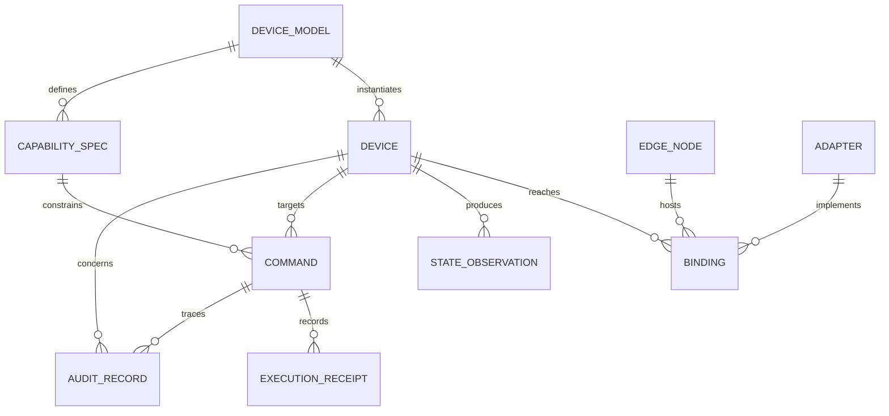

# Core Domain Model

Status: Proposed for implementation  
Version: 0.1

Applicability (2026-10-02): device models, bindings, observations and receipt invariants remain useful under [v0.3](device-node-services-v0.3.md). The external `domain_ref` partitioning described below is replaced by internal `domain_id`, DomainAlias and DomainGrant; migration is pending. Stable operation identity and action effect semantics follow v0.3 R2. AI service metadata is a separate model, and Node leases do not authorize automatic device takeover. This page is not the complete current model or an implementation claim.

## Model objective

The domain model separates stable device meaning from volatile network and protocol details. AI concepts are intentionally absent from the core: an agent is a caller, not a managed device-domain entity.



## Core aggregates

### DeviceModel

A reusable description of a class of devices. It owns capability definitions but contains no instance address or credential.

Important fields:

- stable model identifier and version;
- manufacturer/model metadata;
- capability specifications;
- compatibility and lifecycle metadata.

### Device

A registered physical or virtual thing instance.

Important fields:

- platform device identifier;
- DeviceModel reference;
- lifecycle and reachability status;
- device identity and trust posture references;
- opaque `domain_ref`, optional `space_ref`, and labels;
- current preferred binding.

Device does not store human relationships or natural-language aliases as authority-bearing data.

### CapabilitySpec

A protocol-independent contract of one of three kinds:

- `property`: readable or writable state;
- `action`: an invocable physical operation;
- `event`: an asynchronous occurrence or stream.

It defines typed input/output, units, constraints, risk classification, observability, and confirmation requirements. Protocol endpoints do not belong here.

### Binding

The mapping from a Device capability to an Adapter and protocol endpoint. Bindings may change without changing the public capability contract.

### EdgeNode

An independently managed execution host with identity, trust posture, software version, connectivity, capacity, and device-connection leases.

### StateObservation

An immutable observation containing:

- device and property;
- typed value;
- source;
- observed time and received time;
- monotonic source version when available;
- quality and freshness metadata.

The latest-state projection is a cache derived from observations, not proof that the physical world still matches it.

### Command

An immutable request to invoke one capability on a target. It contains normalized input, request context, idempotency key, deadline, and current lifecycle state.

### ExecutionReceipt

Immutable evidence emitted as command execution progresses. A receipt identifies the stage, time, executor, result, error, and supporting observation when available.

### Adapter

A versioned package that implements a southbound protocol or ecosystem bridge. It declares supported model/capability bindings and operational requirements.

### AuditRecord

An append-only security and operational record. It captures actor references, origin runtime, authorization decision, operation, target, result, and trace correlation.

## External references

These identifiers are accepted from integrated systems but are not modeled internally:

- `subject_ref`: authenticated human, service, or agent principal;
- `domain_ref`: household, organization, tenant, vehicle, or other authority domain;
- `space_ref`: room, zone, site, or application-defined location;
- `policy_ref`: externally managed policy or delegation reference.

AgenticIoT may maintain resource-side rules keyed by these references. It does not decide the human meaning behind them.

## Invariants

1. Every Device instantiates exactly one versioned DeviceModel.
2. Every externally invocable capability has a typed schema and risk classification.
3. CapabilitySpec never contains vendor credentials or a transport address.
4. Every command has a unique platform ID and caller-scoped idempotency key.
5. A command cannot become successful solely because it was dispatched.
6. A confirmed physical action requires adapter acknowledgement or a correlated state observation, as declared by the capability.
7. Device credentials never appear in public API responses, Thing descriptions, logs, or agent-visible resources.
8. State values without freshness and source metadata are not returned as authoritative.
9. Terminal command receipts are append-only.
10. An agent cannot obtain more authority than the authorization presented with its request.

## Canonical capability example

```json
{
  "id": "light.v1",
  "version": "1.0.0",
  "properties": {
    "power": {"type": "boolean", "readable": true},
    "brightness": {"type": "integer", "minimum": 0, "maximum": 100, "unit": "%"}
  },
  "actions": {
    "set_brightness": {
      "input": {"type": "object", "required": ["value"], "properties": {"value": {"type": "integer", "minimum": 0, "maximum": 100}}},
      "risk": "low",
      "confirmation": "observed_state"
    }
  },
  "events": {
    "power_changed": {"data": {"type": "boolean"}}
  }
}
```
