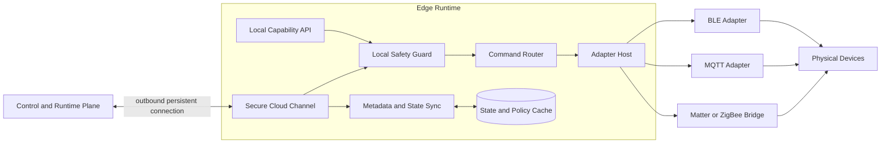

# Edge Runtime

Status: Proposed for implementation  
Version: 0.1

Applicability (2026-10-02): [v0.3](device-node-services-v0.3.md) R3–R7 govern current Node design. WSS replaces the simulated HTTP polling transport; observations and commands are scheduled independently with bounded cross-device concurrency. Offline policy classes, local capability APIs, automatic writer takeover and broad synchronization below are deferred concepts, not first-release requirements. Native subscriptions are optional Adapter extensions and sampled changes are explicitly labeled. Current implemented capabilities remain as described in the implementation note.

## Role

Current implementation (2026-10-02): the default transport is WSS, backed by a durable NodeSession lease and a single-owner SQLite journal. Read and action scheduling are independent. See [ADR 0011](../adr/0011-async-node-runtime.md); the dated HTTP implementation note below is historical.

Implementation note (2026-09-14): an independent local Edge now uses HTTP polling,
a separate credential and a SQLite execution journal/outbox. A minimal Adapter host
supports virtual lights and loopback MQTT simulated lights. This is not the production
runtime below: mTLS, writer fencing, dynamic protocol plugins and offline grants remain
pending. See [execution guide](../api/execution.md), [MQTT guide](../api/mqtt-adapter.md)
and [ADR 0006](../adr/0006-minimal-adapters-and-mqtt-demo.md).

The Edge Runtime is AgenticIoT's trusted execution component near physical devices. It terminates device protocols, hosts adapters, caches the minimum required state and policy, and continues explicitly allowed operations during cloud disconnection.

It is not an AI Agent runtime, identity provider, workflow engine, or source of human-domain truth.



## Required behavior

- establish an outbound mutually authenticated connection to the platform;
- register runtime identity, version, supported adapters, and resource capacity;
- synchronize assigned devices, bindings, capability schemas, and bounded policy cache;
- accept commands, revalidate local constraints, and route to adapters;
- emit observations, events, health, and execution receipts;
- preserve monotonic local sequence numbers across reconnects;
- safely drain, upgrade, and transfer device connection leases.

## Adapter contract

The implemented interface is intentionally limited to `read(thing_id)`,
`invoke(command)` and `close()`, plus an adapter ID and explicit journal-atomicity flag.
Platform binding performs assignment; current light mappings are fixed, not configurable.
Discovery, subscriptions, health objects and dynamic loading will be added only with
a concrete protocol/device need. The following broader interface is a future concept,
not the current SDK:

```text
discover(context) -> stream[DiscoveredEndpoint]
describe(endpoint) -> NativeDescription
bind(device, mapping) -> BindingHandle
read(binding, property) -> Observation
invoke(binding, action, input, deadline) -> AdapterReceipt
subscribe(binding, selector) -> stream[ObservationOrEvent]
health() -> AdapterHealth
close(binding) -> void
```

Adapters receive only the device credentials and capability binding required for their assigned devices. They do not receive caller tokens, personal profiles, or agent memory.

## Offline policy classes

Each capability declares one offline behavior:

| Class | Meaning | Example |
|---|---|---|
| `local_always` | May execute locally when device and Edge identity remain trusted | Read temperature, switch a local light |
| `cached_authorization` | May execute with a valid cached grant and bounded expiry | Adjust a family thermostat |
| `online_required` | Requires an online authorization decision | Remote unlock, ownership transfer, firmware authorization |
| `local_only` | Must never traverse the cloud | Privacy-sensitive raw sensor access |

The default is `online_required`. An unavailable policy is never interpreted as permission.

## Multiple edge nodes

A physical location may contain several eligible runtimes. Device bindings use renewable leases:

- one active writer lease per non-shareable device binding;
- optional read-only observers;
- fencing token on commands to reject a stale runtime;
- lease expiry and controlled takeover;
- no permanent dependency on one speaker, phone, or gateway.

Protocol-specific multi-controller behavior may be represented by separate bindings when the protocol supports it.

## Synchronization

Edge-to-platform uploads are append-first:

1. persist observation, event, or receipt locally;
2. assign an Edge-local sequence;
3. upload in order when connected;
4. platform acknowledges the durable high-water mark;
5. compact only acknowledged entries according to retention policy.

Cloud-to-edge configuration is versioned and applied atomically. Unsupported configuration is rejected rather than partially applied.

## Security requirements

- unique Edge identity and renewable credentials;
- encrypted credential storage;
- signed and versioned adapter packages;
- least-privilege adapter isolation;
- local verification of command deadline, target, capability, policy version, and fencing token;
- redaction of credentials and personal data from logs;
- auditable operator actions and software changes.

Remote attestation is an extension point, not an MVP prerequisite. The trust-posture model must allow it to be added without changing public capability APIs.
