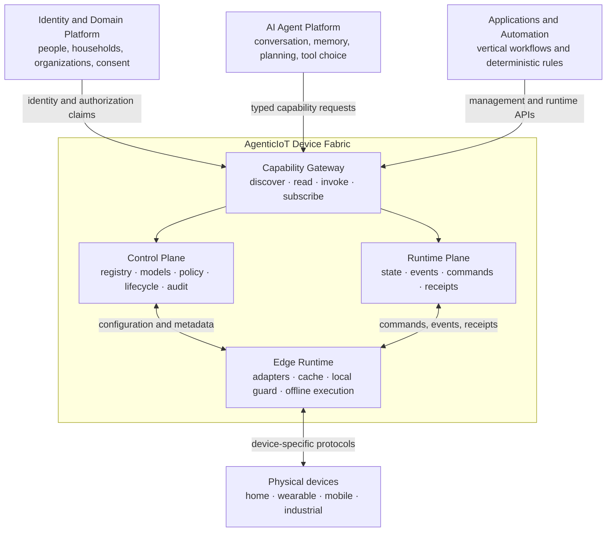
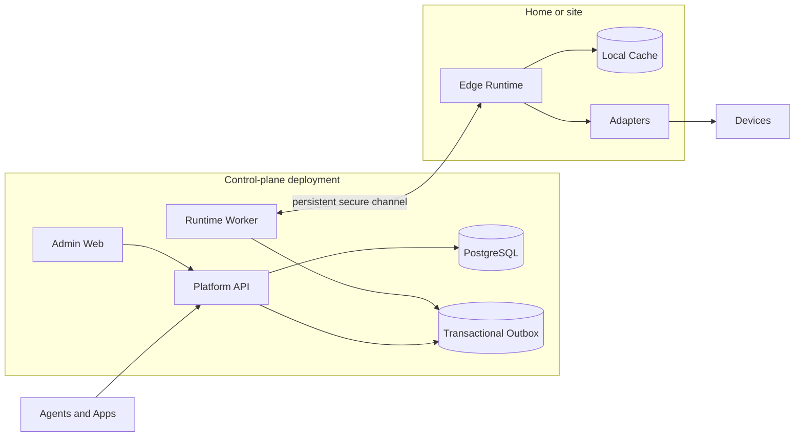

# System Architecture

Status: Superseded system baseline; historical reference  
Version: 0.1

The current design is [Technical Architecture v0.3](device-node-services-v0.3.md) and [ADR 0009](../adr/0009-node-local-services-and-agent-access.md). This page preserves v0.1 for historical reference. The new baseline governs module ownership, local services, internal domains, Agent tools and events, and initial delivery scope. Offline execution, automatic takeover and mandatory outbox infrastructure shown below are not first-release promises. Design acceptance is not implementation or performance validation.

## System context

## Logical containers

## Control plane

The first release is one deployable backend with internal modules:

- Device Registry
- Device Model and Capability Catalog
- Edge Node Management
- Policy Enforcement
- Lifecycle Management
- Audit and Diagnostics

PostgreSQL is the system of record. Modules do not read each other's tables directly; they interact through application services and domain events. A transactional outbox preserves reliable event publication without introducing a broker on day one.

## Runtime plane

The runtime plane handles volatile physical-world activity:

- state observations and freshness;
- device events;
- command acceptance and dispatch;
- execution receipts and evidence;
- edge connectivity and routing;
- timeout and reconciliation.

Runtime APIs remain asynchronous even when an adapter completes immediately. This prevents protocol latency and sleeping devices from leaking into the caller contract.

## Edge runtime

The Edge Runtime is independently deployable and may run on a home hub, speaker, router, industrial gateway, PC, or site server. It exposes the same local capability semantics as the cloud-facing platform while hosting protocol-specific adapters.

No edge node is permanently the logical authority. Ownership of a device connection is leased and recoverable so another eligible node can take over.

## Admin console

The Admin Console is a web client of the Management API. It does not contain domain rules that are absent from the backend. Its purpose is device operations, configuration, diagnosis, and audit—not end-user smart-home interaction or agent chat.

## External contracts

| Contract | Consumer | Purpose |
|---|---|---|
| Management API | Admin Console, operators | Models, devices, edges, adapters, lifecycle, audit |
| Capability API | Agents, applications | Discover, read, invoke, subscribe |
| Event API | Applications, agents | SSE/webhook event delivery and resumable cursors |
| Edge Protocol | Edge Runtime | Sessions, sync, commands, observations, receipts |
| Adapter SDK | Protocol/vendor adapters | Discover, describe, read, invoke, subscribe, health |
| MCP adapter | MCP-compatible agents | Translate capabilities into tools and resources |

MCP is an adapter above the Capability API. It must not bypass policy enforcement or the Command Engine.

## Initial implementation profile

- Backend: Python, FastAPI, Pydantic, SQLAlchemy, Alembic
- Database: PostgreSQL
- Admin: React and TypeScript
- API definition: OpenAPI 3.1
- Live UI updates: Server-Sent Events initially
- Edge/cloud channel: outbound persistent TLS connection from Edge Runtime
- Local development: Docker Compose
- Testing: pytest, contract tests, adapter conformance tests

The Edge Runtime may start in Python for speed. A Go or Rust implementation is considered only when packaging, footprint, hardware access, or reliability measurements justify a second language.

## Deferred infrastructure

Redis, Kafka, a dedicated time-series database, Kubernetes, service mesh, and microservice decomposition are explicitly deferred until a measured requirement appears.
